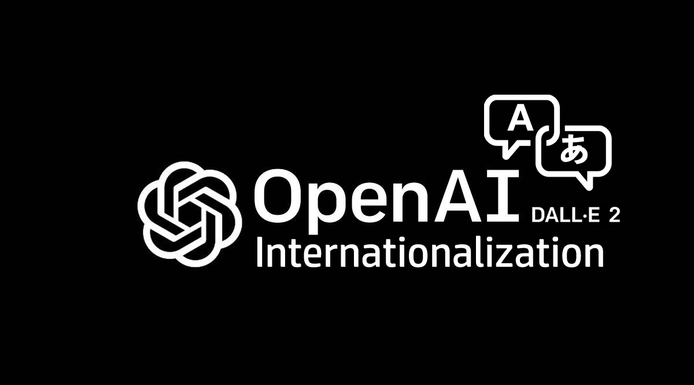

# DALL.E internationalization


### Enhanced DALL.E Wrapper for Internationalization - NodeJS
This NodeJS module acts as a wrapper for DALL.E API and will help you to use DALL.E in your own language.


## Installation

Install dall-e-intl via npm : https://www.npmjs.com/package/dall-e-intl

```bash
  npm i dall-e-intl
```

## Usage/Examples
First, you have to obtain your API key from OPENAI, then you can use it here.
```javascript
import DallEIntl from 'dall-e-intl';
import dotenv from "dotenv";
dotenv.config();

const text = "සුදාම්මිට ඔනෙ කියපු ගිනි පිඹින මකරෙක්, ස්වීට් වෙන්න ඔනෙ, හැන්ඩ්සම් වෙන්නත් ඔනෙ, සුදුඅම්මි ළගම ඉන්නත් ඔනෙ"
const openAiKey = process.env.openAiKey
const lang = 'si';
const opts = {
    model: "image-alpha-001",
    prompt: text,
    num_images: 1,
    size: "1024x1024",
    response_format: "url",
};


DallEIntl(text, DALL_E_API_KEY, opts, lang).then((res) => {
    console.log(res);
}).catch((er)=> {
    console.log(er);
});
```

## API
text - Type: string (The text to be translated)

openAiKey - Type: string (API Key obtained from OpenAI Developer Account)

opts - Type: object (OpenAI Language Model and hyperparameters)

lang - Type: string ( Must be `auto` or one of the codes (not case sensitive) contained in [SUPPORTED_LANGUAGES.md](https://github.com/asirihewage/dall-e-intl/blob/main/SUPPORTED_LANGUAGES.md).)

## Features

- Use DALL.E API in your own language
- Ability to customize the DALL.E image generation model
- Supports more than 50 languages

## Language Support
Supported language codes contained in [SUPPORTED_LANGUAGES.md](https://github.com/asirihewage/dall-e-intl/blob/main/SUPPORTED_LANGUAGES.md)

## Demo
```shell
npm run demo
```
Prompt in Sinhalese language: "සුදාම්මිට ඔනෙ කියපු ගිනි පිඹින මකරෙක්, ස්වීට් වෙන්න ඔනෙ, හැන්ඩ්සම් වෙන්නත් ඔනෙ, සුදුඅම්මි ළගම ඉන්නත් ඔනෙ"


## Authors

- [@asirihewage](https://github.com/asirihewage)

## Contributions

- Issues and feature updates are welcome.


## License

[MIT](https://choosealicense.com/licenses/mit/)
